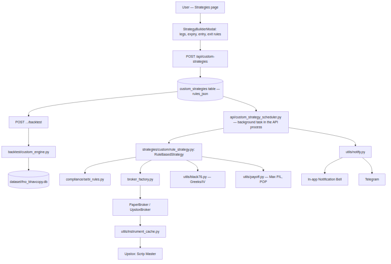
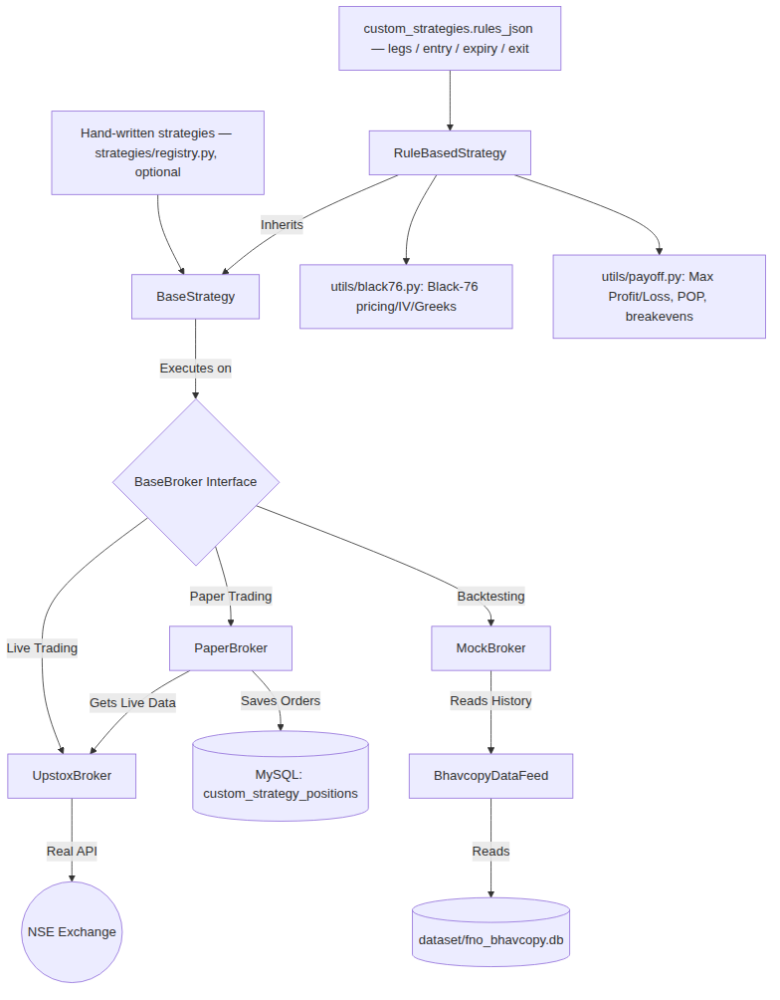

# Automated Trading Bot (Upstox)

A robust, Python-based algorithmic trading system designed specifically for the Indian Stock Market (NSE/NFO), built strictly in adherence to SEBI regulations for retail API trading. Uses `upstox-python` for all real broker/market-data access, with a `BaseStrategy` architecture and `PaperBroker`/`MockBroker` simulation layers so the same strategy code runs unmodified in backtest, paper, and live trading. Fully usable from the CLI/cron alone, or through a React + FastAPI web control panel.

**The primary way to trade with this platform today is the Custom Strategy Builder** (Strategies page) — a no-code, Streak-style UI where you compose any multi-leg NSE options strategy (any combination of Buy/Sell, CE/PE, strike selection, weekly/monthly expiry) from a visual wizard, backtest it against real historical data, paper trade it, then deploy it live — all without writing Python. See "Custom Strategy Builder" below. The hand-written `BaseStrategy` subclass pattern (`strategies/common/base_strategy.py`) still exists underneath — the builder's `RuleBasedStrategy` is itself just one more subclass — and remains available for anyone who wants to write a strategy in Python directly instead of through the UI, but the two original example strategies this README used to walk through (`ten_percent_otm_strangle.py`, `equity_ma_crossover.py`) were retired once the generic builder could express the same thing (and more) without custom code per strategy.

## New Features Added

### 🔐 User Login & Registration
- **Cookie Session Auth**: Session JWT stored in a secure, `HttpOnly`, `SameSite=Lax`, `__Host-` prefixed cookie.
- **CSRF Protection**: Double-submit token pattern requiring validation on all state-changing requests.
- **Bcrypt Hashing**: Passwords stored using bcrypt hashes (work factor 12) via `passlib`.
- **Rate Limiting**: Integrated `slowapi` to protect login (10/min) and registration (5/min) endpoints.
- **Opt-In/Out**: Disabled by default for backward compatibility. Enabled by setting `PANEL_AUTH_ENABLED=true`.

### 📈 Equity Strategy & Watchlist
- **Moving Average Crossover**: Golden cross (short MA crosses above long MA) triggers **BUY LONG**; death cross (short MA crosses below long MA) triggers **SELL (exit)**.
- **DB Persistence**: Positions are tracked in a dedicated `equity_positions` table.
- **Dedicated View**: Equity page in UI displaying watchlist panel, active KPI cards, and open/closed trade tabs.

### 🧩 Custom Strategy Builder (see full section below)
- No-code multi-leg options strategy builder — any combination of Buy/Sell, CE/PE, ATM/OTM% /OTM-points/exact-strike legs, weekly or monthly expiry.
- Real historical backtest (per-cycle, real bhavcopy data, real transaction costs) with a user-selectable date range.
- Paper trading and live deployment run through the same in-process scheduler (`api/custom_strategy_scheduler.py`) — no separate daemon process.
- Black-76 options pricing/Greeks (`utils/black76.py`) — live IV, Delta, Gamma, Theta, Vega on open positions, pushed over WebSocket.
- Expected Max Profit/Loss, Probability of Profit, Risk:Reward, and breakeven(s) computed from current live premiums (`utils/payoff.py`).
- In-app + Telegram notifications (`utils/notify.py`) for order rejections, failed square-offs, login failures, and instrument-master download failures.

---

## Architecture & Project Structure

The bot is designed with clear separation of concerns to keep strategy logic isolated from broker implementation and SEBI compliance rules. `src/automate/` is a real installable package (`pip install -e .`) — every internal import is `from automate.X import Y`, so nothing depends on being run from one exact directory.

### Flow Diagram



### Testing & Simulation Architecture



### Directory Structure

```text
automate/
├── pyproject.toml            # Makes src/automate importable (pip install -e .)
├── docs/                     # Diagram assets referenced above
├── data/
│   ├── historical/           # Real downloaded candle CSVs (download_real_history.py)
│   └── runtime/
│       └── strategy_overrides.json # Runtime edits (MODE/SYMBOLS/lots/SL/TP/exit-days) made from the web control panel — layered on top of config.py, see "Web Control Panel" below
├── dataset/                  # Raw bhavcopy archives + dataset/fno_bhavcopy.db, the SQLite source the backtest engine reads directly (gitignored)
├── scripts/                   # Standalone operational scripts
│   ├── refresh_all_data.py             # ONE command to run the whole data pipeline in order
│   ├── download_real_history.py        # Downloads real spot + option candles from Upstox
│   ├── import_bhavcopy_to_db.py        # Bulk raw bhavcopy CSV -> dataset/fno_bhavcopy.db
│   ├── fill_bhavcopy_gap.py            # Downloads NSE's own bhavcopy archive to fill date gaps
│   ├── import_historical_csvs_to_db.py # data/historical/*.csv -> candles table (same DB)
│   └── migrate_to_mysql.py             # One-time/ad-hoc bulk copy: SQLite (trading.db legacy + dataset/fno_bhavcopy.db) -> MySQL, chunked. The live app itself doesn't need this — positions/backtest_runs already write straight to MySQL (see DatabaseConfig below) and the backtest engine still reads dataset/fno_bhavcopy.db directly; this script exists for anyone wanting the bhavcopy/candles data queryable from MySQL too (analytics, external tools).
├── tests/                     # pytest suite — see "Testing" below
├── src/automate/              # The actual package — everything below is `automate.X`
│   ├── config.py               # Centralized configuration (no secrets) — DEFAULTS; runtime-overridable, see below
│   ├── cli/                    # Entry points — `python3 -m automate.cli.X`
│   │   ├── run_strategy.py       # Position entry — standalone (cron-scheduled) or via run_daemon
│   │   ├── run_position_monitor.py # Exits on SL/TP trigger or expiry — standalone or via run_daemon
│   │   └── run_daemon.py         # LEGACY — cron/systemd-style daemon for hand-written strategies via STRATEGY_CONFIGS. No longer auto-started (strategies/registry.py is now empty); superseded by api/custom_strategy_scheduler.py below. Still works standalone if you register a hand-written strategy in strategies/registry.py yourself.
│   ├── api/                    # Web control panel's FastAPI backend — see "Web Control Panel" below
│   │   ├── main.py                # App + router wiring; starts all background tasks below on startup; serves frontend/dist as static files if built
│   │   ├── routes_custom_strategies.py # CRUD + backtest + expected-payoff + templates/symbols + templates/expiries for the Custom Strategy Builder
│   │   ├── routes_strategy_deployment.py # deploy/pause/resume/stop for a custom strategy (pause/stop square off any open position)
│   │   ├── custom_strategy_scheduler.py  # Background task (started in main.py, NOT a separate process) — enters/exits every PAPER_TRADING/LIVE custom strategy each tick, cycle-aware (won't double-enter the same expiry)
│   │   ├── token_refresh_scheduler.py    # Background task — daily headless Upstox login, moved here from run_daemon.py
│   │   ├── live_greeks.py         # Shared Black-76 Greeks computation for open custom-strategy legs (used by both the REST endpoint and the WebSocket)
│   │   ├── ws_custom_strategy_greeks.py  # WebSocket — pushes live Greeks for one custom strategy's open legs
│   │   ├── routes_notifications.py, ws_notifications.py # REST + WebSocket for the in-app notification bell (see utils/notify.py)
│   │   ├── routes_positions.py    # Open/closed positions, manual close
│   │   ├── routes_strategies.py   # View/edit MODE, SYMBOLS, NUM_LOTS, SL/TP, exit-days for hand-written strategies; known-symbols lookup
│   │   ├── routes_daemon.py       # Start/stop/status for the legacy run_daemon.py, managed as a plain OS process
│   │   ├── routes_backtest.py     # Legacy hand-written-strategy backtest (structured JSON, persists historical runs) — separate from routes_custom_strategies.py's backtest endpoint
│   │   ├── routes_dashboard.py    # /api/performance — backtest vs paper vs live comparison by symbol
│   │   ├── routes_leaderboard.py  # /api/leaderboard — ranked P&L by strategy/symbol/mode
│   │   ├── routes_wallet.py       # /api/wallet, /api/wallet/ledger, /api/orders — virtual paper-trading wallet, funds statement, order book (all derived from positions, no extra tables)
│   │   ├── routes_logs.py         # Tails logs/daemon.log
│   │   ├── ws_positions.py        # WebSocket — pushes live open-position/MTM snapshots
│   │   ├── market_broadcaster.py  # Background task — pushes live LTPs to /ws/market subscribers
│   │   └── deps.py                # Shared broker/audit/rate-limiter singletons, MTM calculation
│   ├── auth/                   # Daily Upstox token refresh (manual + headless auto-login)
│   ├── broker/                  # Broker abstraction layer
│   │   ├── base_broker.py         # Base interface
│   │   ├── broker_factory.py      # Builds the paper + live broker pair
│   │   ├── upstox_broker.py       # Live: Upstox implementation (incl. real basket/multi-order, market depth)
│   │   ├── paper_broker.py        # Sim: paper trading against live data, no separate db of its own
│   │   └── mock_broker.py         # Sim: historical backtesting
│   ├── backtest/                # Runs the REAL strategy classes — no separate reimplementation
│   │   ├── __main__.py             # SIMPLE unified entry point: symbol + type + date range (`python3 -m automate.backtest`) — legacy hand-written-strategy path
│   │   ├── data_feed.py           # Loads real intraday candle CSVs, serves prices by simulated time
│   │   ├── engine.py              # Steps through real intraday bars, reports one real trade's P&L (legacy)
│   │   ├── bhavcopy_data_feed.py  # Serves prices from the daily bhavcopy DB, one simulated date at a time
│   │   ├── historical_engine.py   # Runs a hand-written strategy across every historical expiry cycle (legacy — 2-leg only)
│   │   └── custom_engine.py       # Generic N-leg backtest for the Custom Strategy Builder — same bhavcopy data, cycle discovery respects weekly/monthly expiry choice
│   ├── compliance/              # SEBI rules and regulatory checks
│   │   └── sebi_rules.py           # Kill switch, rate limiter, audit trail
│   ├── strategies/               # Trading strategy implementations
│   │   ├── common/base_strategy.py # Abstract base class shared by every strategy, hand-written or builder-generated
│   │   ├── custom/rule_schema.py   # The composable rules JSON contract (legs/entry/expiry/exit) the builder UI produces
│   │   ├── custom/rule_strategy.py # RuleBasedStrategy — generic interpreter that executes ANY rules_json basket (entry, preview, order placement/unwind)
│   │   └── registry.py             # Hand-written strategy registry — empty by default now; add an entry here only if writing a new strategy directly in Python
│   └── utils/                    # Shared utilities
│       ├── black76.py              # Black-76 option pricing, implied volatility solver, Greeks, and risk-neutral probability (N(d2)) — same model Sensibull/Zerodha's calculators use
│       ├── payoff.py               # Expiry payoff-diagram math — max profit/loss, breakevens, probability of profit
│       ├── notify.py               # Single funnel for in-app + Telegram alerts, deduplicated — see db.models.Notification
│       ├── costs.py                # Real Indian F&O transaction cost model — itemised brokerage/exchange-charges/GST/STT/SEBI/stamp-duty breakdown, not just a total
│       ├── margin.py               # Shared rough margin/capital-needed estimate (index vs stock rate), used by the backtest engine, the live-side wallet, and the payoff calculator's ROI%
│       ├── pnl.py                  # Single gross/net P&L + charges calculator for a short strangle — the one formula every P&L surface (positions, dashboard, leaderboard, websocket) now shares instead of each re-deriving its own
│       ├── wallet.py               # Derived virtual paper-trading wallet + funds ledger — balance/margin/charges recomputed from the positions table on every request; starting capital itself is the one real DB row (wallet_settings, see db/migrations/versions/0002_wallet_settings.py), editable via /api/wallet/capital
│       ├── wallet_adjustments.py   # Manual deposit/withdrawal log (data/runtime/wallet_adjustments.json) — same runtime-JSON pattern as strategy_overrides.py
│       ├── orders.py               # Derived order book — expands each position into its up-to-4 real leg fills (CE/PE entry+exit), no separate order log
│       ├── instrument_cache.py     # Daily master symbol downloader + dynamic lot-size/strike-step/tradable-symbol/nearest-future-key resolution
│       ├── logger.py               # Custom logging setup
│       ├── market_calendar.py      # Live NSE holidays and freeze qty
│       ├── option_utils.py         # Strike calculation math + stop-loss/take-profit trigger math + weekly/monthly expiry resolution
│       ├── position_tracker.py     # Position CRUD against MySQL (see DatabaseConfig/config.py) — SL/TP/expiry tracking, paper + live
│       ├── strategy_overrides.py   # Runtime-editable MODE/SYMBOLS/NUM_LOTS/SL/TP/exit-days layered on config.py, see below (hand-written strategies only)
│       ├── backtest_history.py     # Persists historical backtest runs (backtest_runs table) for the dashboard comparison view
│       └── telegram_alert.py       # Low-level Telegram sender — utils/notify.py is the higher-level funnel that also writes the in-app notification table
├── frontend/                  # Web control panel's React/TypeScript frontend (Vite) — see "Web Control Panel" below
│   ├── src/
│   │   ├── views/                 # Dashboard, Positions, Strategies, Leaderboard, Wallet, Orders, Backtest, Logs (one per sidebar route)
│   │   ├── store/                 # Redux Toolkit — positions/strategies/daemon slices
│   │   ├── charts/                # Chart.js wrappers — PnlBarChart, EquityCurveChart, ComparisonBarChart, PositionStatusDonut
│   │   └── layout/Shell.tsx       # Sidebar + topbar shell (React Router outlet)
│   ├── node_modules/           # gitignored — `npm install`
│   └── dist/                  # gitignored — production build output (`npm run build`), served by nginx and/or uvicorn directly
├── .env.example               # Template for credentials and market hours
└── requirements.txt           # Python dependencies
```

---

## Key Features & SEBI Compliance

This system was built with safety and compliance as the highest priority:

- **Dynamic NSE Instrument Masters:** Downloads and caches the daily scrip masters from official exchange/broker sources. No hardcoded symbol maps.
- **Dynamic Market Calendar:** Fetches live NSE holidays and F&O freeze quantities directly from the NSE public APIs to handle mid-year changes and ad-hoc closures perfectly.
- **SEBI Market Hours Gate:** Orders are strictly blocked outside of NSE F&O trading hours (09:15 to 15:30 IST) or on holidays.
- **Pre-Trade Price Bands:** Rejects orders if the calculated strike price falls outside the exchange's ±20% circuit filter limits.
- **Order Rate Limiter:** Enforces the SEBI retail API limit of a maximum of 10 orders per second.
- **Kill Switch:** A thread-safe, atomic flag that can immediately halt all order generation.
- **Immutable Audit Trail:** Logs every order attempt to a dedicated file (`logs/audit_trail.log`) for compliance auditing.
- **Basket Order Submission + Auto-Unwind:** Legs are submitted together/sequentially (Upstox supports a real single-call multi-order batch API for same-direction legs; `BaseBroker.place_basket_sell_order()`). This is **not atomic on any broker** — one leg can fill while another fails. If that happens, the filled leg(s) are bought/sold back (squared off) automatically, retried with backoff, before the strategy halts — so a partial fill never leaves a naked position open. See `strategies/custom/rule_strategy.py`'s `_place_leg()` / `_unwind_leg()` (the current, generic N-leg implementation).
- **One position per cycle, always closed before expiry:** entry is skipped for a symbol that already has an open position (no accumulating a fresh strangle on top of one still open), and every position is force-closed at least `EXIT_DAYS_BEFORE_EXPIRY` days before its own expiry (default 1), never literally on expiry day. `TenPercentOTMStrangleConfig.TAKE_PROFIT_PCT`/`STOP_LOSS_PCT` add optional early-exit triggers on top of that — as a % of premium collected. `run_position_monitor.py` watches open positions (tracked in MySQL, see `utils/position_tracker.py`) on its own cron schedule and exits them when triggered, with the same retry + `ALERT_MANUAL_INTERVENTION_*.flag` escalation as entry-side auto-unwind. See "One Cycle at a Time" / "Post-Entry Risk Controls" below.
- **Real Transaction Cost Model, applied everywhere P&L is shown:** `utils/costs.py` computes brokerage, NSE exchange transaction charges, GST, STT (0.15% sell-side, per NSE Circular Ref. 02/2026 effective 1 Apr 2026), SEBI turnover fees, and stamp duty. `utils/pnl.py` is the one gross/net P&L formula every surface shares — positions (open MTM and closed), the live WebSocket feed, the Dashboard, the Leaderboard, and the backtest report all now net the same real costs out, with the itemised breakdown available per trade, instead of each computing its own gross-only number.
- **Virtual paper-trading wallet:** a funds ledger (starting capital, margin blocked on open positions, charges paid, running balance) and an order book, both derived on request from the `positions` table (`utils/wallet.py`/`utils/orders.py`) rather than a second, separately-maintained balance — see the Wallet/Order Book pages in the Web Control Panel below.

---

## Custom Strategy Builder

The Strategies page is a no-code, Streak-style wizard for composing any multi-leg NSE options strategy — the 10% OTM short strangle this README originally shipped as a hand-written example is now just one possible thing you can build here, not special-cased code.

**How a strategy is defined.** Every strategy is a `rules_json` blob on its `custom_strategies` row (`strategies/custom/rule_schema.py` documents/validates the exact shape) — nothing about a specific user's strategy lives in a file:
```json
{
  "legs": [
    {"action": "SELL", "option_type": "CE", "strike_selection": {"mode": "OTM_PERCENT", "value": 10}, "lots": 1},
    {"action": "SELL", "option_type": "PE", "strike_selection": {"mode": "OTM_PERCENT", "value": 10}, "lots": 1}
  ],
  "entry": {"mode": "IMMEDIATE", "time": null},
  "expiry": {"mode": "MONTHLY"},
  "exit": {"take_profit_pct": 60, "stop_loss_pct": null, "exit_time": null, "exit_days_before_expiry": 1}
}
```
Strike selection modes: `ATM`, `OTM_PERCENT`, `OTM_POINTS`, `FIXED`. Expiry: `WEEKLY` (nearest listed expiry of any kind) or `MONTHLY` (the last expiry listed within a calendar month — `utils/option_utils.find_nearest_expiry_by_type()`), always re-resolved fresh at every entry, never a frozen date. Up to 8 legs, any mix of BUY/SELL — a straddle, strangle, iron condor, calendar-adjacent spread, or anything else is just a different combination of the same leg shape.

**Execution engine.** `strategies/custom/rule_strategy.py`'s `RuleBasedStrategy` is a generic `BaseStrategy` subclass that interprets a `rules_json` blob at runtime — resolves the underlying's spot/futures price, the target expiry, each leg's strike (directional: OTM for a CE means above spot, for a PE means below), and places legs sequentially (SELL first, so collected premium funds margin for any BUY legs). Any leg failing after another already filled triggers an immediate square-off of everything that did fill (retried 3x with backoff before escalating to a notification), the same guarantee the original hand-written strangle had, generalized to N legs of mixed direction.

**Backtest.** `backtest/custom_engine.py` walks every real historical expiry cycle in `dataset/fno_bhavcopy.db` for the chosen date range (user-selectable in the UI — quick presets or an exact From/To), driving the same `RuleBasedStrategy` through `MockBroker`. Real transaction costs (`utils/costs.py`) are netted out of every cycle; cycle discovery respects the strategy's weekly/monthly expiry choice.

**Paper & live.** One background asyncio task per the whole API process — `api/custom_strategy_scheduler.py`, started in `main.py`, not a separate daemon/service — polls every `PAPER_TRADING`/`LIVE` strategy each tick during market hours. Entry is gated per **expiry cycle**, not calendar day: if a position exits early (TP/SL hit), the scheduler won't re-enter the same soon-to-expire contract the next morning — it waits until the resolved nearest expiry actually rolls over. Paper P&L now nets real transaction costs too (previously only backtest did) — slippage was already applied on both paths via `PaperBroker`/`MockBroker`.

**Risk analytics**, computed from CURRENT live option premiums (works even on a still-Draft strategy, via a read-only preview — `RuleBasedStrategy.preview()` never places an order):
- Black-76 Greeks (`utils/black76.py`) — implied volatility solved from the real traded premium (Newton-Raphson + bisection fallback), then Delta/Gamma/Theta/Vega/Rho from that solved IV. Pushed live over `/ws/custom-strategy-greeks/{id}` for open paper/live positions.
- Expected Max Profit/Loss, Risk:Reward, breakeven(s), and Probability of Profit (`utils/payoff.py` — the classic piecewise-linear expiry payoff diagram; POP is the market-implied N(d2) probability under the same Black-76 distribution, not a real-world forecast) — shown on the strategy detail page, refreshable on demand.

**Notifications.** `utils/notify.py` is a single funnel that writes an in-app row (bell icon, live over `/ws/notifications`) and sends to Telegram (if configured — see "Operational Alerts" below) for: order rejections (commonly insufficient margin/funds), failed auto-unwind/square-off (naked position risk), Upstox login failures, and instrument-master download failures. Deduplicated in-process (15 min window) so a persistent failure doesn't spam every tick.

---

## Setup & Installation

### 1. Prerequisites
- Python 3.10+
- Node.js 18+ (only needed to build the web control panel's frontend — see "Web Control Panel" below; the CLI/bot itself doesn't need Node at all)
- An active Demat account with F&O segment activated.
- Approved Upstox API access (developer.upstox.com).

### 2. Install Dependencies
```bash
python3 -m venv .venv
source .venv/bin/activate
pip install -r requirements.txt -r requirements-dev.txt
pip install -e .            # makes automate.* importable everywhere (see pyproject.toml)
```
**Use a real, regular-user-executable `python3`** (a normal apt/deadsnakes install, or `pyenv`) as the interpreter behind `python3 -m venv` — verified the hard way: a venv built from a Python that's itself a symlink into `/root/...` (e.g. a root-owned conda/miniconda install) silently "works" for whoever set it up, then fails with `Permission denied` for every other user, since `/root` typically isn't traversable by anyone else. `python3 --version` and `ls -la $(readlink -f $(which python3))` before creating the venv are worth checking if this ever happens again.

### 3. Environment Configuration
Copy the sample environment file:
```bash
cp .env.example .env
```
Edit `.env` and fill in your Upstox `UPSTOX_API_KEY`/`UPSTOX_API_SECRET`, and `DB_USER`/`DB_PASSWORD`/`DB_NAME` for a MySQL instance you control (positions/backtest_runs/wallet_settings all live there — see `db/engine.py::DatabaseConfig`).

### 4. Database Schema
Create the tables (idempotent — safe to re-run; only applies migrations not already applied):
```bash
alembic upgrade head
```
See `src/automate/db/migrations/versions/` for what each revision adds.

### 5. Broker Authentication
Upstox API access tokens expire daily. Run `python3 -m automate.auth.upstox_auth` every morning before the market opens to generate a fresh token and save it to `.env` — or set up headless auto-login (`python3 -m automate.auth.upstox_auto_login`) so this happens on its own; see "Operational Alerts" below and that module's docstring for the security tradeoff involved before enabling it.

---

## Configuration (legacy — hand-written strategies only)

**If you're using the Custom Strategy Builder (the primary path — see above), none of this section applies** — a strategy's symbols/lots/SL/TP/expiry are all set in the wizard UI and stored on its DB row, not in `config.py`. This section only matters if you're writing a new strategy directly in Python (a `BaseStrategy` subclass registered in `strategies/registry.py`) instead of through the UI.

Unlike global environment variables, strategy-specific configurations are handled entirely in Python. To add stocks or change lot counts, edit the `TenPercentOTMStrangleConfig` class inside `config.py`:

```python
class TenPercentOTMStrangleConfig:
    # List of symbols to trade
    SYMBOLS = ["RELIANCE", "TCS"]
    
    # How many real NSE lots to sell per leg. Actual order quantity =
    # NUM_LOTS x the REAL lot size, resolved live (see below) —
    # NUM_LOTS itself is a lot COUNT, not a share quantity.
    NUM_LOTS = 1

    # Strike interval and lot size are NOT configured here at all — both
    # are resolved live from the broker's real instrument master (see below).
```

**There is no lot-size or strike-step table anywhere in this codebase — on purpose.** Both are resolved LIVE, every time, from Upstox's own instrument master (`BaseBroker.get_lot_size()`/`get_strike_step()` — real for `UpstoxBroker`/`MockBroker`, delegated for `PaperBroker`). Hardcoded tables for both were tried and removed after each turned out to already be wrong the moment it was checked against a real instrument master (lot size: a web-search-sourced value listed RELIANCE as 250, the real current value is 500; TCS as 300, really 225 — NSE revises lot sizes without much notice, e.g. NIFTY/BANKNIFTY changed again in Jan 2026. Strike step: RELIANCE was configured as 20, really 10; TCS as 50, really 20 — and this one wasn't hypothetical, it was the direct cause of the `"Exact strike not found, falling back..."` warning that showed up on nearly every run). A stale static number for either is a real-money risk: it silently computes/rounds to a strike or quantity that doesn't match what's actually listed or intended. If either can't be resolved dynamically for a symbol, `TenPercentOTMStrangle` raises rather than guessing.

`TAKE_PROFIT_PCT`/`STOP_LOSS_PCT` (post-entry exit thresholds, see "Post-Entry Risk Controls" below) and `EXIT_DAYS_BEFORE_EXPIRY` (see "One Cycle at a Time" below) are more fields on the same `TenPercentOTMStrangleConfig` class — plain Python, edited the same way as `SYMBOLS`, not read from `.env` (these are this strategy's own config, no reason to split them out — and keeping them out of `.env` means a future second strategy's own risk-control settings can never collide with this one). `TAKE_PROFIT_PCT`/`STOP_LOSS_PCT`'s `None` means **disabled** — this is the default on purpose, not just an unset placeholder; see below for why. `EXIT_DAYS_BEFORE_EXPIRY` has no "disabled" state — a position is always closed before expiry, only *how many days before* is configurable.

`MODE` (`"paper"` or `"live"`, default `"paper"`) is likewise this strategy's own field, not a global/CLI setting — see "Paper vs. Live: It's a Per-Strategy Setting" below.

**These same fields (`MODE`, `SYMBOLS`, `NUM_LOTS`, `TAKE_PROFIT_PCT`, `STOP_LOSS_PCT`, `EXIT_DAYS_BEFORE_EXPIRY`) can also be edited at runtime from the web control panel's Strategies page**, instead of hand-editing `config.py` and restarting every process — see "Web Control Panel" below. `config.py`'s values are the *defaults*; an edit made in the UI is layered on top in `data/runtime/strategy_overrides.json` (via `utils/strategy_overrides.get_effective_config()`) and takes effect on the daemon's next loop tick, no restart needed. With no override file, behavior is identical to `config.py` alone — this is purely additive, and every CLI entry point below already reads through `get_effective_config()` so the CLI and the control panel are always looking at the same effective values.

---

## Running the Bot (legacy CLI path — hand-written strategies only)

**Custom Strategy Builder strategies (the primary path) need none of this** — the API process (`uvicorn`, started once, see "Web Control Panel" below) already runs their entry/exit/token-refresh as background tasks (`api/custom_strategy_scheduler.py`, `api/token_refresh_scheduler.py`). This whole section — `run_strategy.py`, `run_position_monitor.py`, `run_daemon.py`, cron — is the older, still-functional path for a hand-written `BaseStrategy` subclass registered in `strategies/registry.py`, not started automatically by anything anymore.

Every `python3 -m automate...` command below assumes the venv is active (`source .venv/bin/activate`) or that you're calling `.venv/bin/python` directly — `automate` is only installed inside `.venv`, not system-wide, so running these with your system `python3` fails with `ModuleNotFoundError: No module named 'automate'`.

### Manual Run
You can run the strategy manually from your terminal.

```bash
# Uses ACTIVE_STRATEGIES from .env, each in its own configured MODE (paper/live)
python3 -m automate.cli.run_strategy
```

### Paper vs. Live: It's a Per-Strategy Setting
There are exactly three modes anywhere in this system: paper, live, and backtest (a separate subsystem) — no fourth "dry-run" flag layered on top of any of them. Paper-vs-live is **not** a CLI flag or an `.env` value — it's each strategy's own `MODE` field in its `config.py` entry (e.g. `TenPercentOTMStrangleConfig.MODE = "paper"`), right next to that strategy's `SYMBOLS`. `MODE="paper"` always trades through `PaperBroker` (real market data, simulated fills, never real money); `MODE="live"` always places real orders with your real Upstox account — live means live, unconditionally. Every strategy defaults to `MODE="paper"` — flip it to `"live"` only after you've proven it out.

This means several strategies can run side by side at different stages of trust — one already proven and live, another still being paper-tested — in the exact same cron/daemon invocation, with zero risk of them affecting each other's mode. `run_strategy.py`/`run_daemon.py` build **one paper broker and one live broker** up front (sharing a single real connection — see `BrokerFactory.create_mode_brokers()`) and route each strategy to whichever one its own `MODE` says.

### Choosing Which Strategies Actually Go Live
`strategies/registry.py` (`STRATEGIES`) is shared with backtesting — a strategy can exist there and be backtested without ever going live. What `run_strategy.py` actually **executes** is controlled separately by `config.RunConfig.ACTIVE_STRATEGIES` (`.env`'s `ACTIVE_STRATEGIES`, comma-separated strategy names), so adding a new strategy for backtesting purposes can't silently make it start placing real orders. Each active strategy also needs a matching entry in `config.STRATEGY_CONFIGS`, including its own `MODE` (different strategies aren't forced to share one global symbol list, or one global paper/live setting).

```bash
# Uses ACTIVE_STRATEGIES from .env
python3 -m automate.cli.run_strategy

# Run only specific strategies this one time, ignoring .env — still each in its own configured MODE
python3 -m automate.cli.run_strategy --strategies ten_percent_otm_strangle
```

### Running Hands-Free: `run_daemon.py`
`run_strategy.py` (entry) and `run_position_monitor.py` (exits — see below) are each single-shot scripts, meant to be triggered by *something* on a schedule. Rather than encoding that schedule as cron timing flags (a separate line for "once at 09:20", another for "every 5 minutes from 9 to 15"), `run_daemon.py` wraps both into ONE persistent process that knows NSE market hours itself and decides when to act — cron's only job becomes "make sure this one process is running," not "know when to run it."

```bash
python3 -m automate.cli.run_daemon
```

Each tick it checks (via the same live market-calendar logic every other entry point uses) whether the market is actually open right now; if not, it sleeps and checks again later. If it is open, it attempts entry once per calendar day (tracked with a marker file so a restart mid-day can't double-enter) and checks every open position for stop-loss/take-profit/expiry every ~60 seconds — the same underlying logic as `run_strategy.py`/`run_position_monitor.py`, just self-scheduled instead of cron-scheduled. Paper vs. live is resolved per strategy exactly as above — nothing about that changes just because it's the daemon calling it.

Cron becomes one line — just start it, nothing about *when*, nothing about paper/live:
```bash
# Starts the daemon at system boot. @reboot only fires on an actual reboot,
# so also run this same command once manually right after setup.
@reboot cd /path/to/automate && nohup /path/to/automate/.venv/bin/python -m automate.cli.run_daemon >> logs/daemon.log 2>&1 &
```
For crash resilience beyond what a bare `@reboot` line gives you (cron doesn't supervise long-running processes — if the daemon dies, it stays dead until the next reboot), run it under `systemd` instead (`ExecStart=` the same command, `Restart=always`).

**Prefer the old two-cron-line design instead** (separate `run_strategy.py`/`run_position_monitor.py` cron entries, each fired externally)? Both scripts still work standalone exactly as before — `run_daemon.py` is an additional option, not a replacement.

### Operational Alerts (Telegram)
A headless daemon fails silently unless something tells you it didn't. Set `TELEGRAM_BOT_TOKEN`/`TELEGRAM_CHAT_ID` in `.env` (get a token from [@BotFather](https://t.me/BotFather), then message your bot once and read your chat_id off `https://api.telegram.org/bot<TOKEN>/getUpdates`) and `utils/telegram_alert.py` sends a message for:
- **Every trade opened** (entry succeeded) and **every trade closed** (SL/TP/expiry exit), tagged with which strategy, symbol, and mode (🧪 paper / ✅ live).
- **Every failed entry** — a compliance skip (e.g. strike not found) or a FATAL unhandled exception. An expired/invalid broker token surfaces here too (the error message includes the real `HTTP 401` from the broker), so a stale Upstox token gets flagged instead of silently skipping trades all day.
- **Any exit that couldn't complete** (`run_position_monitor.py`'s manual-intervention case) — the highest-urgency alert, since the position is left open with real (or paper) risk unmanaged until someone acts.
- **A daily heartbeat** (`run_daemon.py` only) — "still running", open position count, market status — sent once a day regardless of market status (weekends/holidays included). The other alerts above only fire on activity, so a hung or crashed daemon on an otherwise-quiet day (no trades, no errors) would look identical to "everything's fine" without this.

Leave both blank to disable — the bot behaves exactly as before, alerts are purely additive. A Telegram outage/misconfiguration never blocks trading: `send_telegram_alert()` catches every failure itself and just logs it.

### One Cycle at a Time, Always Closed Before Expiry
Two rules govern timing, independent of SL/TP:

- **Entry: once per monthly cycle, never more.** Before entering, `run_entries()` checks `has_open_position(strategy_name, symbol)` (`utils/position_tracker.py`) and skips that symbol if a position is already open — otherwise a daemon/cron attempting entry every trading day would sell a *fresh* strangle on top of an already-open one, accumulating many concurrent naked positions by the time expiry approached. Combined with daily entry attempts, this naturally makes "no open position yet" line up with "start of the next cycle": the very first day after the previous position closes is when the next one opens.
- **Exit: always at least `EXIT_DAYS_BEFORE_EXPIRY` days before expiry (default 1), never on expiry day itself.** This is a hard floor, separate from SL/TP — see `TenPercentOTMStrangleConfig.EXIT_DAYS_BEFORE_EXPIRY` in `config.py`. It exists to stay clear of expiry-day gamma/liquidity risk and, for stock options, the compulsory physical-settlement risk (below) — not to lock in profit. Recorded per-position at entry time (like `MODE`), so a later config change can't reach back into an already-open position.

### Post-Entry Risk Controls: Stop-Loss / Take-Profit
On top of the always-on pre-expiry exit above, `TAKE_PROFIT_PCT`/`STOP_LOSS_PCT` are additional, OPTIONAL early-exit triggers — **disabled is the default, deliberately, not just an unset placeholder.** Set them on `TenPercentOTMStrangleConfig` in `config.py` (or pass `take_profit_pct`/`stop_loss_pct` directly to the strategy) to close early instead, as a **% of the premium collected** (e.g. `STOP_LOSS_PCT = 150` exits once the loss reaches 1.5x what you collected; `TAKE_PROFIT_PCT = 60` exits once you've captured 60% of the max possible profit). See `utils/option_utils.py`'s `strangle_pnl_pct()`/`check_exit_trigger()` for the exact math.

**Why there's no default value, on purpose:** a stop-loss caps your worst single loss, but it ALSO cuts short positions that would have recovered and expired profitably. Backtesting real RELIANCE data over a short window (6 cycles, one of which was a big loss) made a 150% stop-loss look like a clear win. Widening to a longer, more representative window (19 cycles) reversed that finding entirely:

| Config | Total P&L (19 cycles) | Win Rate | Worst Trade |
|---|---|---|---|
| No stop-loss | **+₹27,275.77 (19.21%)** | 18/19 (95%) | -₹19,280.33 |
| Stop-loss 40% (best tested) | +₹21,173.05 (14.91%) | 14/19 (74%) | -₹4,582.71 |
| Stop-loss 150% | +₹6,641.61 (4.68%) | — | -₹13,907.20 |

No stop-loss won on total return despite the much larger worst-case loss — the stop-loss's constant cost (repeatedly exiting trades early that would have come back) outweighed the benefit of capping that one bad cycle, once measured over enough cycles. **This is a genuine preference (smaller, more predictable worst-case vs. higher average return), not a free improvement** — there is no universally "right" threshold, and the right choice depends on your own risk tolerance and (very likely) differs by symbol. Always validate via backtest before enabling this live.

**Entering a position does NOT by itself monitor it.** Every fill (paper or live, regardless of whether SL/TP is configured) is recorded to MySQL (`positions` table); something has to separately watch it and exit when needed. `run_daemon.py` (above) does this automatically as part of its own tick loop. If you're instead running `run_strategy.py`/`run_position_monitor.py` as two separate cron-scheduled scripts, schedule the monitor more frequently, independently of the entry job:

```bash
# Check open positions every 5 minutes during market hours (Monday to Friday)
*/5 9-15 * * 1-5 cd /path/to/automate && /path/to/automate/.venv/bin/python -m automate.cli.run_position_monitor >> logs/position_monitor_cron.log 2>&1
```

Each position is exited through whichever mode (paper or live) it was actually **entered** with — recorded on the position row itself at entry time, not re-derived from the strategy's current config, so changing a strategy's `MODE` later can never misroute an already-open position's exit. mode='paper' always simulates the exit; mode='live' always places a real exit order the moment a trigger fires — no dry-run preview step. If closing a leg fails after retries, the position is left OPEN (retried next run) and a `logs/ALERT_MANUAL_INTERVENTION_*.flag` file is written, same pattern as the entry-side auto-unwind.

**Expiry safety net (always on, not tied to SL/TP):** once a position enters its own recorded pre-expiry buffer (`entry.expiry - EXIT_DAYS_BEFORE_EXPIRY`, above), `run_position_monitor.py` force-closes it regardless of SL/TP state — this is *why* every position gets recorded, not just ones with SL/TP configured. It reads each position's own `expiry` field, so this works correctly for any future strategy too, whatever its expiry cadence (weekly, monthly) or instrument (stock, index) — nothing here is hardcoded to this strategy's monthly-stock schedule. This matters most for **stock options, which are compulsorily physically settled in India** (unlike index options, which are cash-settled) — an ITM stock leg left open past expiry can trigger real share delivery/receipt obligations far larger than the options margin the position was using, and nothing else in this codebase currently guards against that.

**Validate thresholds via backtest first** — `python3 -m automate.backtest.historical_engine --symbol X --stop-loss-pct N --take-profit-pct N` (or pass `none` to explicitly turn either off) runs the exact same trigger math day-by-day against real historical data, and applies the same `--exit-days-before-expiry` buffer by default (pass `0` to see the original held-to-literal-expiry numbers for comparison). Use as long a date range as you can, not just a window you already know contains one bad cycle — see the table above for why that matters.

---

## Web Control Panel

A localhost-only React dashboard + FastAPI backend for everything above, as an **additive** interface — every CLI command in this README keeps working exactly as documented whether or not the control panel is running. It reads/writes the same MySQL database, `data/runtime/strategy_overrides.json`, and `logs/daemon.pid` the CLI already uses; there is no separate state.

What it can do:
- View open positions with live mark-to-market P&L (pushed over a WebSocket, not polled) and closed positions, both **net of real Indian F&O charges** (brokerage/exchange/GST/STT/SEBI/stamp-duty — see `utils/costs.py`/`utils/pnl.py`), with the itemised breakdown available per position.
- **Virtual wallet** (Wallet page): available balance, margin blocked, lifetime charges paid, and a chronological funds statement — all derived on the fly from the `positions` table (no separate ledger to drift out of sync). Starting capital is a real DB-backed setting (`wallet_settings` table, defaults to ₹0), editable any time from the Wallet page or `POST /api/wallet/capital` — no env var, no restart. Deposits/withdrawals (`POST /api/wallet/adjust`) are logged individually so the funds statement always shows why the balance changed, not just a single overwritten number. A "reset closed history" action (`POST /api/wallet/reset`) clears realised paper-trading history without touching open positions or anything in `live` mode.
- **Order book** (Order Book page): every real leg fill (CE/PE entry + exit, paper and live), derived the same way.
- Manually close an open position on demand.
- Edit a strategy's `MODE` (paper/live), `SYMBOLS` (add/remove — autocompletes against every stock/index that genuinely has listed F&O contracts today, sourced from the real downloaded instrument master, not a hardcoded list), `NUM_LOTS`, `TAKE_PROFIT_PCT`/`STOP_LOSS_PCT` (blank = off), and `EXIT_DAYS_BEFORE_EXPIRY` — see the runtime-override note above.
- Start/stop the trading daemon (`run_daemon.py`) as a real OS process, not a simulated toggle.
- Run a backtest and see the results as a real chart + sortable grid (color-coded P&L, exit-reason badges) instead of raw terminal text — the historical (multi-cycle) path runs `HistoricalCycleEngine` in-process and every run is persisted to `backtest_runs`.
- **Compare performance by symbol across backtest, paper, and live** on the Dashboard — a grouped bar chart plus a detail table, so you can see at a glance whether a symbol's real paper/live results are tracking its backtested expectation.
- Tail `logs/daemon.log`.

### Architecture
```
Browser ──▶ nginx (127.0.0.1:8090) ──┬─▶ / , /positions, ...  → frontend/dist (static React build)
                                      ├─▶ /api/*               → uvicorn (127.0.0.1:8000, FastAPI)
                                      └─▶ /ws/*                → uvicorn (WebSocket upgrade)

uvicorn (automate-api.service, systemd, Restart=always) ──▶ same DB/override-file/PID-file as the CLI
run_daemon.py (started/stopped BY the API, or by cron @reboot) ──▶ everything above, unchanged
```
**The trading daemon is deliberately *not* a systemd service**, even though the API is. The control panel's Start/Stop-daemon buttons manage `run_daemon.py` as a plain detached subprocess (PID file at `logs/daemon.pid` + `SIGTERM` — see `run_daemon.py`'s `_run_with_pid_file()`/signal handler), which needs to be startable/stoppable on demand from the UI; a systemd `Restart=always` unit would just relaunch it the instant the API tried to stop it. It still survives independently via the existing `@reboot` cron line.

**A real gotcha this surfaced, now fixed**: `subprocess.Popen(..., start_new_session=True)` detaches the daemon from the API's *session*, which protects it from `Ctrl+C`/terminal signals — but a child process still inherits its parent's **cgroup** regardless of session, and systemd's default `KillMode=control-group` kills every process in a service's cgroup on stop/restart. In practice this meant `systemctl restart automate-api` was silently also killing the trading daemon. Fixed with `KillMode=process` in the unit file (kills only the tracked uvicorn PID, leaves the daemon alone) — if you ever recreate this service, make sure that line is there, or a routine API redeploy will take live/paper trading down with it.

### Running it

**Development** (hot-reload frontend, separate ports):
```bash
# Terminal 1 — backend
source .venv/bin/activate
uvicorn automate.api.main:app --host 127.0.0.1 --port 8000 --reload

# Terminal 2 — frontend (Vite dev server proxies /api and /ws to :8000, see frontend/vite.config.ts)
cd frontend && npm install && npm run dev   # http://127.0.0.1:5173
```

**Production** (what's actually deployed on this machine): nginx serves the built frontend and reverse-proxies `/api`/`/ws` to uvicorn, which runs as a systemd service.
```bash
# One-time: build the frontend
cd frontend && npm install && npm run build   # → frontend/dist

# One-time: install the systemd unit (deploy/automate-api.service — edit User=/
# WorkingDirectory= if your checkout isn't at /var/www/html/automate; keep
# Restart=always and KillMode=process — see the gotcha above)
sudo cp deploy/automate-api.service /etc/systemd/system/
sudo systemctl daemon-reload
sudo systemctl enable --now automate-api

# One-time: install the nginx site (deploy/automate-nginx.conf — listens on
# 127.0.0.1:8090 by default, edit the port if you need a different one;
# proxies /api and /ws to 127.0.0.1:8000, roots frontend/dist for everything
# else, sets the WebSocket upgrade headers on /ws/)
sudo cp deploy/automate-nginx.conf /etc/nginx/sites-available/automate
sudo ln -s /etc/nginx/sites-available/automate /etc/nginx/sites-enabled/automate
sudo nginx -t && sudo systemctl reload nginx
```
Open **http://127.0.0.1:8090** (or whatever port `deploy/automate-nginx.conf` was set to). Redeploying after a code change: `git pull` (or edit), then `cd frontend && npm run build` for frontend-only changes, or `sudo systemctl restart automate-api` for backend changes — the daemon is unaffected by either, per the `KillMode=process` fix above.

Bound to `127.0.0.1` only, by design, both in nginx's `listen` directive and uvicorn's `--host` — this is meant to be reached over SSH port-forwarding or from the same machine, never exposed on a public interface. No login/auth layer exists; don't put this behind a public IP without adding one.

---

## Backtesting & Forward Testing (Paper Trading)

The system includes a robust simulation engine that perfectly mirrors real-world execution, allowing you to test any strategy without risking capital.

### Simple: One Command
```bash
python3 -m automate.backtest --symbol RELIANCE --type stock --from 2026-07-20 --to 2026-07-27
python3 -m automate.backtest --symbol NIFTY --type index --from 2015-01-01 --to 2019-12-31
```
Symbol, type (`index`/`stock`, auto-detected if omitted), a date range. That's it — `backtest/__main__.py` automatically routes to whichever backend can actually serve that range:

- **Recent range** (`--from` within the last ~30 days) → real Upstox minute candles, downloaded automatically, simulating **one real trade** with real fills/slippage/costs (see "Recent Data" below).
- **Older range** → the bhavcopy database, simulating **every historical monthly expiry cycle** in that window and reporting aggregate win-rate/P&L statistics (see "Long-History Data" below).

These are genuinely different kinds of output (one trade vs. many cycles of statistics) because they come from genuinely different data (live intraday ticks vs. daily EOD settlement) — the tool tells you which one it used rather than pretending they're interchangeable. **Known gap:** live data covers roughly the last 30 days, and the bhavcopy database covers ~2000–2020 (bundled conversion) plus, once `scripts/fill_bhavcopy_gap.py` has been run, NSE's own archive from ~Sep 2020 to a few days ago. A request outside all of that returns zero results rather than fabricated numbers — the sections below explain what's actually happening under the hood, and how to rebuild/extend the data yourself.

### Recent Data (Live Upstox, One Real Trade)
Test your strategies against **real** historical market data — no synthetic prices anywhere in this path.
- `MockBroker` intercepts every broker call; `backtest/data_feed.py` serves real candle data back by simulated timestamp.
- Slippage is applied to every fill (worse-direction: lower on SELL, higher on BUY), same as live/paper.
- Real 1-minute historical spot **and option-leg** candles are downloaded from the Upstox History API.
- The SEBI market-hours/weekend/holiday gate validates against the **simulated** timestamp, not real wall-clock time (`BaseBroker.get_current_time()`).
- **Accurate P&L:** `utils/costs.py` computes real brokerage/STT/GST/exchange/SEBI/stamp-duty costs. The report separates **realized** P&L (an actual closing BUY on the same instrument, e.g. an auto-unwind) from **unrealized** P&L (mark-to-market against the last real bar in the dataset — not a true expiry settlement).

**Data-source limitations (read before using):**
- Upstox only exposes option chain *listings* (which strikes/tokens exist) for currently-live expiries — not expiries that have already lapsed. So you can't retroactively discover "what strikes existed on some past date." Instead, the downloader resolves the CE/PE legs the strategy would pick **right now** (current spot ±10% band, nearest monthly expiry) and downloads real recent candles for those specific real contracts — it does not let you replay arbitrary strikes from months ago. Only NSE stocks and NSE indices (NIFTY, BANKNIFTY, FINNIFTY, MIDCPNIFTY) are supported — MCX commodities are intentionally out of scope (their options reference a specific futures series as underlying, with its own expiry offset from the option's expiry, which needs separate handling this codebase doesn't implement).
- **`--days` is capped by Upstox per interval** (verified empirically — exceeding it fails with HTTP 400 `UDAPI1148 Invalid date range`, and this applies equally to spot and options): `1minute` → 30 days max, `30minute` → 90 days max, `day`/`week` → effectively unlimited (tested 1000+ days back). `download_real_history.py` auto-clamps `--days` to the limit for the interval you chose and warns you. For a longer historical window you'd need `--interval day`, but that loses intraday entry timing, realistic slippage, and the minute-by-minute mark-to-market this engine is built around.

**Step 1 — Download real data.** Just plain symbol names — no manual ISIN/instrument_key lookup needed, works for both stocks and indices:
```bash
# One symbol (stock or index)
python3 scripts/download_real_history.py --symbol RELIANCE
python3 scripts/download_real_history.py --symbol NIFTY

# Several at once
python3 scripts/download_real_history.py --symbols RELIANCE,TCS,NIFTY,BANKNIFTY

# Everything in config.TenPercentOTMStrangleConfig.KNOWN_STOCK_SYMBOLS + KNOWN_INDEX_SYMBOLS
python3 scripts/download_real_history.py --all

# Options:
#   --days N          trailing days of candles (default 5)
#   --spot-only        skip auto CE/PE resolution+download
```
This resolves the equity/index key, current spot, nearest expiry, and CE/PE strikes+tokens automatically (same logic `TenPercentOTMStrangle` uses live), downloads real 1-minute candles for all three legs to `data/historical/`, and **saves a manifest** (`data/historical/<symbol>_manifest.json`) so the backtest command stays simple.

**Step 2 — Run the backtest engine.** Just the symbol — everything else is read back from the manifest Step 1 saved:
```bash
python3 -m automate.backtest.engine --symbol RELIANCE
```
Add `--entry-time "2026-07-21T09:20:00+05:30"` to enter at a specific bar (default: the very first bar in the dataset), or `--slippage-pct 0.01` / `--num-lots 2` etc. to override defaults — any flag you pass explicitly overrides the manifest. `--num-lots` is a lot **count**; actual quantity is resolved from the real per-symbol lot size (see Configuration above).

Using data that didn't come from Step 1 (hand-picked contracts, bhavcopy-derived CSVs)? Pass the per-contract flags manually instead — run `python3 -m automate.backtest.engine --help` for the full list.

### Long-History Data (Bhavcopy Database, Aggregate Statistics)
Upstox's own history API caps out at 30 days for 1-minute candles and can't discover expired option contracts. For genuinely long-history analysis, this repo builds a single SQLite database (`dataset/fno_bhavcopy.db`) from NSE's real daily F&O settlement data (bhavcopy) — which, unlike Upstox, *does* include expired contracts — and runs the REAL strategy class (via `backtest/historical_engine.py`'s `MockBroker` + `BhavcopyDataFeed`, the daily-data counterpart to `backtest/engine.py`'s intraday path) across every historical expiry cycle rather than one trade. There's no separate hand-written copy of the strategy's entry logic here — change the strategy once, and both live trading and this backtest pick it up.

**Data-quality reality check (read before trusting any numbers from this path):** bhavcopy is daily EOD settlement data, not intraday ticks — there's no realistic entry timing or slippage model, just the day's official settlement price. Worse: zero-volume days report a theoretical/carried-forward price with **no real trade behind it**, and this is most common at exactly the ~10%-OTM strikes this strategy sells. Every row is tagged with its real trade volume, and every stats report splits **ALL cycles** from **LIQUID-ONLY cycles** (every leg had real volume) — the two give meaningfully different numbers, and "ALL" is optimistic. Transaction costs also use today's rates applied retroactively (STT/GST/exchange fees have all changed multiple times since 2000) — approximate for older cycles, not historically exact.

**Keeping everything current, day to day:** once the database is bootstrapped (step 1 below, one-time), `python3 scripts/refresh_all_data.py` runs steps 2–4 (gap-fill to yesterday, live candle refresh, DB sync) together, idempotently, in the right order — safe to cron daily. `--symbols X,Y,Z` to override which live symbols get refreshed (default: `config.TenPercentOTMStrangleConfig.SYMBOLS`), `--skip-live` to refresh only the bhavcopy DB without touching Upstox.

**Building the database from scratch, or running steps individually:**
1. **Bulk import** a raw bhavcopy archive (e.g. a Kaggle dump — bring your own CSV, place under `dataset/`, gitignored) into the DB. Streams the source **one row at a time**, never loading it into pandas/a list, bounded memory regardless of file size (verified: ~20MB peak RAM importing 112M rows / 8.9GB in ~29 minutes):
   ```bash
   python3 scripts/import_bhavcopy_to_db.py --source dataset/archive_3/fobhav.csv --db dataset/fno_bhavcopy.db
   ```
2. **Fill the gap to today** by downloading NSE's own official daily bhavcopy archive directly (verified live: publicly downloadable from ~2021 through a few days ago, no login needed). Handles NSE's old and new "UDiFF" file formats transparently, is rate-limited to be a reasonable citizen of NSE's archive, and is resumable (skips dates already in the DB) — writes into the **same** `fno_bhavcopy` table, not a separate database:
   ```bash
   python3 scripts/fill_bhavcopy_gap.py --db dataset/fno_bhavcopy.db --from-date 2020-09-01 --to-date 2026-07-24
   ```
3. **Import your `data/historical/` CSVs too** (real Upstox downloads + the FUTIDX-proxy daily series below), tagged by symbol/leg, into a `candles` table in the same DB file — one unified database, not scattered CSVs:
   ```bash
   python3 scripts/import_historical_csvs_to_db.py --dir data/historical --db dataset/fno_bhavcopy.db
   ```

**Running the statistics** directly (this is what `python3 -m automate.backtest` calls for older date ranges):
```bash
python3 -m automate.backtest.historical_engine --symbol NIFTY --type index --from-date 2015-01-01 --to-date 2019-12-31
python3 -m automate.backtest.historical_engine --symbol RELIANCE --type stock --from-date 2024-01-01 --to-date 2024-12-31
```
Reports a plain-language, Indian-Rupee-formatted table: every individual trade taken (entry/exit dates, strikes, money blocked, profit/loss, return %), plus a summary (win rate, total/average P&L, best/worst trade). Money amounts and win/loss counts are also split into ALL cycles vs LIQUID-ONLY cycles (every leg had real trading volume) — see the module docstring in `backtest/historical_engine.py` for the full data-quality caveats. `--num-lots` is a lot **count** (default 1) — actual quantity is `num_lots x` the real lot size resolved live from today's cached Upstox instrument master, same as strike interval (`--strike-step` to override; both resolved dynamically by default, no hardcoded table, the strategy raises if the cache is missing/stale). Note this uses **today's** lot size/strike step for every cycle, even decades-old ones — both have changed multiple times over this history and that timeline isn't reconstructed here.

Add `--take-profit-pct N` / `--stop-loss-pct N` (both default to `none` = disabled) to test early-exit thresholds against real daily closes on top of the default pre-expiry exit — see "Post-Entry Risk Controls" above, **including the real longer-window result where no-stop-loss actually won on total return.** `--exit-days-before-expiry N` (default 1, matching the strategy's real default) controls that floor; pass `0` to see the original held-to-literal-expiry numbers instead. The table always shows an "Exit Reason" column (Take Profit / Stop Loss / Pre-Expiry Exit). Always test over as long a real date range as you can — a short window that happens to contain one bad cycle will make a stop-loss look better than it really is.

### Forward Testing (Live Paper Trading)
Run strategies live during market hours without executing real orders on the exchange.
- Uses `PaperBroker` to fetch real-time live data (LTP and option chains) but never places a real order.
- Slippage is applied to the live LTP to record a realistic simulated entry/exit price.
- Recorded into the same MySQL `positions` table as everything else — there used to be a second, PaperBroker-only SQLite log (`paper_trades.db`) plus a separate `run_paper_tracker.py` viewer script for it; both were removed as a redundant duplicate once `run_position_monitor.py` already watches every position (paper or live) and reports P&L on every check (plus Telegram alerts on open/close — see "Operational Alerts" above).

**To run a strategy in paper trading mode:** set `MODE = "paper"` on that strategy's `config.py` entry (this is already the default for every strategy) and just run normally:
```bash
python3 -m automate.cli.run_strategy
```

**To watch your paper trades' live P&L:** `run_position_monitor.py`/`run_daemon.py` already log this on every check (entry/current prices, P&L%, trigger status) and send a Telegram alert on open/close — see "Operational Alerts (Telegram)" above.

---

## Production Readiness — Honest Status

Closer to production grade than it was, after a dedicated pass to fix the gaps this section used to list — but still not there. Every fix below was verified (real test run, or a real command against real data/APIs), not just written and assumed correct.

**Fixed this pass:**
- **Paper trading now behaves like a real broker, not just a P&L counter.** Previously only the backtest report netted out real Indian F&O charges (brokerage/exchange/GST/STT/SEBI/stamp-duty) — every live/paper surface (`deps.py::compute_mtm`, the closed-positions route, the Dashboard's `_closed_pnl`, the Leaderboard's `_pnl`) independently computed its own **gross-only** P&L, so the numbers shown to the user never reflected real trading costs. Fixed by extracting one shared `utils/pnl.py::compute_strangle_pnl()` and wiring it into every one of those call sites, plus adding a virtual wallet and order book — `utils/wallet.py`/`utils/orders.py`, exposed via `/api/wallet`, `/api/wallet/ledger`, `/api/orders` and the new Wallet/Order Book pages. Balance/margin/charges math is fully derived from the `positions` table on every request (no separate ledger row to drift out of sync); the one genuinely mutable piece — starting capital — is a real DB row (`wallet_settings`, migration `0002`), editable at runtime instead of an env var needing a restart, with deposits/withdrawals logged individually (`utils/wallet_adjustments.py`) rather than silently overwriting a single number.
- **Automated test suite exists** (`tests/`, pytest, 47 tests) — pure logic (strike math, cost model), compliance gates, and critically a **regression test for the naked-position bug** (partial-fill → auto-unwind) so it can't silently come back. Still no CI to run it automatically (see below).
- **`.env` permissions fixed** to `600`, owner-only (was found world-readable/writable, `-rwxrwxrwx`) — re-check this (`ls -la .env`) after any deploy/cron setup that might recreate it with looser permissions.
- **Auto-unwind now retries** (3 attempts with backoff) before giving up, and **escalates on final failure** beyond a log line — writes a standalone `logs/ALERT_MANUAL_INTERVENTION_*.flag` file with full details, meant to be polled by an external health check rather than depend on someone reading the log stream at the right moment.
- **Post-order reconciliation added**: an order API call returning an order_id does NOT guarantee the exchange accepted it (e.g. a margin shortfall can reject it afterward) — `TenPercentOTMStrangle` now queries real order status (`BaseBroker.get_order_status()`, implemented for Upstox) after placement and reclassifies/auto-unwinds if a "filled" leg was actually rejected.
- **No hardcoded lot-size table anymore, anywhere.** Lot size is resolved live from the broker's real instrument master every time (`BaseBroker.get_lot_size()`) — proven necessary mid-session when the hardcoded table (sourced from web search) turned out to already be wrong for RELIANCE (250 vs real 500) and TCS (300 vs real 225) the moment it was checked against real data. If a broker can't resolve it dynamically, the strategy refuses to trade rather than guess.
- **Data pipeline is now one command**: `scripts/refresh_all_data.py` runs instrument-master refresh, bhavcopy gap-fill, live candle download, and DB sync in the correct order, idempotently — safe to cron.
- **Both backtest paths now run the REAL strategy class, not a separate reimplementation.** `backtest/historical_engine.py` adds a `BhavcopyDataFeed` (the daily-bhavcopy counterpart to `backtest/data_feed.py`'s intraday candles) and drives `MockBroker` + the actual strategy through every historical expiry cycle, exactly like `backtest/engine.py` already did for intraday data. `scripts/backtest_strangle_stats.py` (a hand-written SQL reimplementation of the strategy's strike/entry logic) is gone — write a strategy once, and live trading, the intraday backtest, and the historical backtest all use it. This also caught and fixed a real bug: NSE's bhavcopy corrupts `settle_pr` (but not `close`) on the expiry date for every option row, which the old script was using and which silently inflated every historical loss.
- **Post-entry stop-loss / take-profit added (disabled by default).** `TenPercentOTMStrangleConfig.TAKE_PROFIT_PCT`/`STOP_LOSS_PCT` (as % of premium collected) can close a position early instead of always holding to expiry; `run_position_monitor.py`, on its own cron cadence, does the actual watching (positions are recorded to `positions.db` on entry). The historical backtest checks the exact same trigger day-by-day against real data. Deliberately shipped OFF by default: an initial 6-cycle RELIANCE backtest made a 150% stop-loss look like a clear win (turned -₹315 into +₹9,089 by cutting one bad cycle short), but widening to 19 real cycles reversed the finding — no-stop-loss won on total return (+₹27,276 vs the best stop-loss tested, +₹21,173) because a stop-loss also cuts short trades that recover by expiry. It's a real risk-tolerance trade-off (smaller worst case vs. higher average return), not a free improvement — validate per-symbol via backtest, over a long window, before enabling.
- **Expiry-day safety net added.** Nothing previously closed a position at expiry — for stock options (compulsorily physically settled in India, unlike cash-settled index options), an ITM leg left open past expiry risks real share delivery/receipt obligations far larger than the margin the position was using. `run_position_monitor.py` now force-closes any open position on/after its own recorded `expiry` date, regardless of SL/TP state, reading each position's own expiry field rather than assuming a fixed cadence — so this works correctly for a future weekly/index strategy too, not just this monthly stock one. This required recording EVERY real fill to `positions.db` (previously only fills with SL/TP configured were tracked, which meant the default — SL/TP off — was never watched by this script at all).
- **`run_daemon.py` added.** `run_strategy.py`/`run_position_monitor.py` are both extracted into reusable functions (`run_entries()`, `monitor_once()`) that this new script calls on its own internal loop — market-hours awareness, once-a-day entry, and periodic position checks all live in Python now, not as separate cron scheduling flags. Cron's job shrinks to one line: keep the process running. Both original scripts still work exactly as before, standalone.
- **Paper vs. live moved from a global broker/CLI setting to a per-strategy `MODE` field.** Previously `BROKER=paper` was a top-level `.env`/`--broker` value that flipped the *entire process* to simulated trading — meaning every active strategy was forced into the same paper/live state together, which broke down the moment a second strategy at a different stage of trust got added. Now each strategy's own `config.py` entry carries `MODE = "paper"` or `"live"` (default `"paper"`), `BrokerFactory.create_mode_brokers()` builds both a paper and a live broker once (sharing a single real connection — `PaperBroker` never calls the real broker's order-placement methods, so this is safe), and `run_entries()`/`monitor_once()` route each strategy/position to its own broker by that field. Positions also record the `MODE` they were entered under, so a later config change can't misroute an already-open position's exit.
- **Repo restructured into a real installable package.** Everything that used to sit loose at the repo root (`config.py`, `run_*.py`, `broker/`, `strategies/`, `utils/`, etc.) now lives under `src/automate/` (`pip install -e .`, every internal import is `from automate.X import Y`), with `run_strategy.py`/`run_position_monitor.py`/`run_daemon.py` moved into `src/automate/cli/` (invoked as `python3 -m automate.cli.X`). Diagram assets moved to `docs/`.
- **Single database for the whole bot.** `positions.db` and a separate, PaperBroker-only `paper_trades.db` (leg-level, consumed only by the now-deleted `run_paper_tracker.py`) are unified into one `positions` table — the AuditTrail (`logs/audit_trail.log`) already independently records every order attempt, so the second SQLite log was a pure duplicate. (Originally one SQLite file, `data/runtime/trading.db`; since moved to MySQL — see `DatabaseConfig` in `config.py` — for the same reasons `scripts/migrate_to_mysql.py` migrates the bhavcopy dataset: query speed at scale.)
- **Upstox-only.** Zerodha and Dhan support (`broker/zerodha_broker.py`, `broker/dhan_broker.py`, `auth/zerodha_auth.py`, the `kiteconnect`/`dhanhq` dependencies, `BROKER=`/`--broker` broker-account selection) is removed — this bot only ever ran against real Upstox credentials, and the multi-broker abstraction was unused, unverified surface area.
- **The DRY_RUN/`--dry-run` blanket safety switch is gone.** There are now exactly three modes anywhere in this system — paper, live, backtest — and no fourth gate layered on top: `MODE="live"` always places real orders, `run_position_monitor.py` always places a real exit the moment a `MODE="live"` position's trigger fires. Safety now comes entirely from `MODE="paper"` being the default for every strategy, not from an extra flag someone has to remember to pass or unset.
- **Real entry-accumulation bug fixed: one position per cycle, always closed before expiry.** `execute()` had no check for an already-open position — combined with a daemon/cron attempting entry once per calendar day, it would sell a *fresh* strangle on the same symbol every single trading day, accumulating many concurrent naked positions by the time expiry arrived, not just one per cycle. `run_entries()` now skips a symbol via `has_open_position()` (`utils/position_tracker.py`) whenever one is already open; combined with daily entry attempts, this naturally makes the first eligible day after the previous position closes the entry day for the next cycle. Paired with a new hard floor, `EXIT_DAYS_BEFORE_EXPIRY` (default 1, per-strategy in `config.py`, recorded per-position like `MODE`) — positions are now always closed at least that many days before their own expiry, never literally on expiry day, regardless of SL/TP state. `backtest/historical_engine.py`'s day-by-day walk applies the exact same buffer by default (pass `--exit-days-before-expiry 0` to see the old held-to-literal-expiry numbers), so backtested results keep matching what live/paper trading actually does.
- **No hardcoded strike-step table anymore, either.** Same class of bug as the lot-size table, just not caught until now: `STRIKE_STEPS` in `config.py` had drifted from real listed strikes for most stocks (RELIANCE configured as 20, really 10; TCS as 50, really 20; several others also wrong) — and this wasn't hypothetical, it was the direct cause of the `"Exact strike X not found in chain, falling back..."` warning seen on nearly every run, meaning the strategy had been silently trading a nearby-but-different strike than the intended ±10% OTM one. `strike_step` is now resolved live from the broker's real instrument master (`BaseBroker.get_strike_step()`, mirroring `get_lot_size()` exactly — the minimum gap between listed strikes for the nearest expiry; refuses to trade rather than guess if unresolvable), for both live/paper trading and both backtest paths (`download_real_history.py` resolves it at download time and saves it in the manifest so `backtest/engine.py`'s later run matches; `backtest/historical_engine.py` resolves it the same way live trading does). Also fixed a related latent bug this surfaced: `find_instrument_token()` truncated every chain strike to an int, which would have permanently broken exact-matching for any stock with a fractional strike interval (e.g. WIPRO's real ₹2.5 spacing) — not currently in `SYMBOLS`, but would have silently misbehaved the moment it was added. One follow-up bug caught by actually re-running a backtest afterward: `python3 -m automate.backtest`'s own wrapper computed a hardcoded fallback (50/20) and passed it through unconditionally, silently overriding the dynamic resolution above every time — fixed by only passing `--strike-step` downstream when the user explicitly set it.
- **Fixed the `.venv` itself being unusable by anyone except whoever originally built it.** It was a real venv, just built from a Python interpreter that was itself a symlink into a root-owned conda install (`/root/miniconda3`) — meaning `.venv/bin/python` silently failed with `Permission denied` for every other user, since `/root` isn't traversable by anyone else. Rebuilt from a properly-installed, regular-user-executable `python3.13` (via the `deadsnakes` PPA on Ubuntu 24.04); also found (and fixed with one recursive `chown`) that thousands of project files had accumulated root ownership from testing under `sudo` before this was caught.
- **Web control panel added: FastAPI backend + React/Redux/Chart.js frontend, deployed behind nginx as a real systemd service.** See "Web Control Panel" above for the full picture. Built as a strictly additive layer — every CLI command in this README was re-verified working unmodified with the API running. `MODE`/`SYMBOLS`/`NUM_LOTS`/`TAKE_PROFIT_PCT`/`STOP_LOSS_PCT`/`EXIT_DAYS_BEFORE_EXPIRY` became runtime-editable (`utils/strategy_overrides.py`, layered on `config.py`'s defaults) so the UI can change them without a restart; `SYMBOLS` picks from every stock/index with real listed F&O contracts today (`InstrumentCache.list_tradable_symbols()`), not a hardcoded list. Historical backtest runs are now persisted (`backtest_runs` table) and compared against real paper/live results by symbol on the Dashboard.
- **Real bug found and fixed: restarting the API was silently killing the trading daemon.** The daemon runs as a detached child process (`subprocess.Popen(start_new_session=True)`) so the control panel can start/stop it independently of the API's own lifecycle — but a child still inherits its parent's **cgroup** regardless of session, and systemd's default `KillMode=control-group` kills every process in a service's cgroup on stop/restart. `systemctl restart automate-api` was taking the (paper-mode, no real money at risk, but still) trading daemon down with it every time. Fixed with `KillMode=process` in the unit file. Caught by actually restarting the service mid-session and checking `logs/daemon.log` afterward, not assumed safe from the `start_new_session=True` alone.

**Still open:**
- **No CI.** Tests exist and pass, but nothing runs them automatically — this isn't a git repository with a remote, so there's nowhere for CI to run yet.
- **`run_daemon.py`'s MODE='live' exit-order path is unverified against a real live account** — the paper-mode entry/exit path (including Telegram alerts) has been run end-to-end for real against live Upstox market data; a genuine MODE='live' order (real money) has not, since this session only ever had a paper-mode strategy configured.
- **No automated backup for `dataset/fno_bhavcopy.db`** (single ~27GB SQLite file) — rebuildable from source (Kaggle archive + NSE's public bhavcopy + live downloads) but that takes real time.
- **The control panel's recent-date backtest path (real minute data, one trade) isn't in structured/chart form yet** — only the historical (multi-cycle) path is; a recent-date run still returns the raw CLI text output for the UI to display as-is. It also isn't persisted to `backtest_runs`, so it won't show up in the Dashboard's backtest-vs-paper-vs-live comparison.
- **Control panel has no authentication layer, by design** — it's bound to `127.0.0.1` only and meant to be reached over SSH port-forwarding or from the same machine. Don't put it behind a public IP without adding one first.

**What was already solid and still is:** the SEBI compliance gates (kill switch, rate limiter, market-hours check), the basket-order + auto-unwind mechanism, the real transaction-cost model — all verified against live APIs or real historical data, not assumed.

### Testing
```bash
pip install -r requirements-dev.txt   # adds pytest + rich on top of requirements.txt
python3 -m pytest tests/ -v
```
Runs in the same environment as everything else (`.venv`) — no separate test venv. All 66 tests are hermetic — no network calls, no real credentials — except a handful in `tests/test_dynamic_lot_size.py` that are skipped automatically if no cached instrument master is present on disk.

---

## Disclaimer

**High Risk Warning:** Selling options carries extremely high risk. The Call (CE) leg has theoretically unlimited risk, and the Put (PE) leg carries substantial downside risk. You must ensure you have sufficient SPAN and Exposure margins maintained in your broker account. This software is provided for educational and automation purposes only. Use it at your own financial risk.
